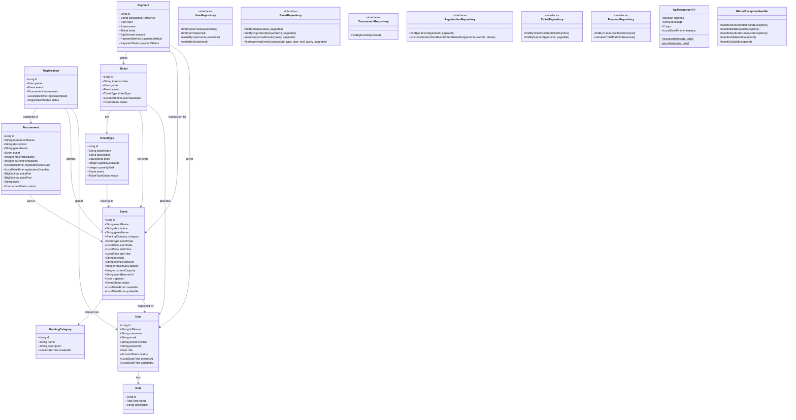

# Backend Class Diagram

This document describes the layered class structure of the Spring Boot application, detailing the entities, services, repositories, controllers, and exception hierarchies.

---

## Mermaid Class Diagram

