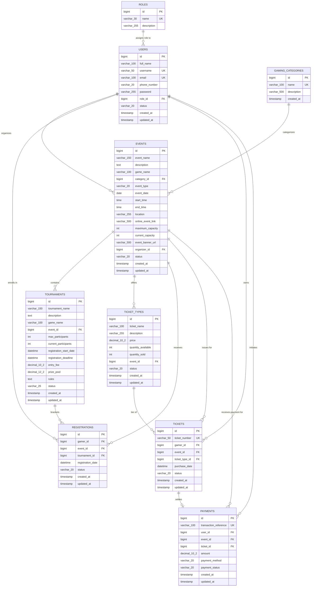

# Entity Relationship (ER) Diagram

This document describes the complete relational database entity model for the **Gaming Event Ticketing and Registration Platform**, detailing table attributes, data types, primary keys (PK), foreign keys (FK), and cardinality.

---

## Mermaid ER Diagram

---

## Cardinality & Key Rules Summary
1. **Users & Roles**: `1:N` — A user has exactly one assigned role (`ROLE_ADMIN`, `ROLE_ORGANIZER`, `ROLE_GAMER`).
2. **Events & Categories**: `1:N` — Each event belongs to one gaming category (FPS, MOBA, Battle Royale, etc.).
3. **Events & Organizers**: `1:N` — An organizer can manage many events; events reference their owner for authorization.
4. **Events & Tournaments**: `1:N` — An event can host multiple game stages/tournaments.
5. **Events & Ticket Types**: `1:N` — An event can have multiple ticket tiers (General, VIP, Early Bird).
6. **Registrations**: Composite unique constraint on `(gamer_id, event_id, tournament_id)` prevents accidental duplicate enrollments.
7. **Tickets**: Each ticket has a globally unique `ticket_number` (`GAME-2026-XXXXX`).
8. **Payments**: Tracks financial transactions with unique `transaction_reference` linked to the buyer and target event/ticket.
